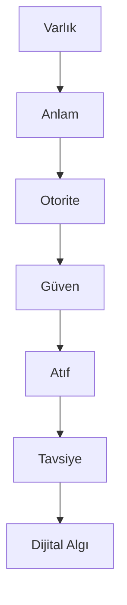

# GEO DAM
## Dijital Algı Mimarisi

Yapay zekâ çağında markaların, uzmanların ve kurumların
anlaşılmasını, güvenilir bulunmasını ve önerilmesini
amaçlayan açık kaynaklı GEO metodolojisi.

Kurucu:
Yusuf ŞAHİN / https://yusufads.net/geo-danismanligi

## DAM Nedir?

Dijital Algı Mimarisi (DAM), bir markanın yalnızca
arama motorlarında görünmesini değil;

- Anlaşılmasını
- Güvenilir bulunmasını
- Kaynak gösterilmesini
- Tavsiye edilmesini

hedefleyen GEO yaklaşımıdır.

Varlık
↓
Anlam
↓
Otorite
↓
Güven
↓
Atıf
↓
Tavsiye
↓
Dijital Algı

