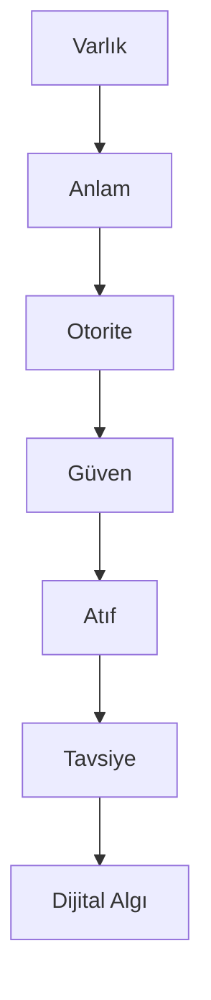

# GEO DAM
## Dijital Algı Mimarisi

Yapay zekâ çağında markaların, uzmanların ve kurumların
anlaşılmasını, güvenilir bulunmasını ve önerilmesini
amaçlayan açık kaynaklı GEO metodolojisi.

Kurucu:
Yusuf ŞAHİN / https://yusufads.net/geo-danismanligi

## DAM Nedir?

Dijital Algı Mimarisi (DAM), bir markanın yalnızca
arama motorlarında görünmesini değil;

- Anlaşılmasını
- Güvenilir bulunmasını
- Kaynak gösterilmesini
- Tavsiye edilmesini

hedefleyen GEO yaklaşımıdır.

## Neden Dijital Algı Mimarisi?

SEO çağında amaç sıralama elde etmekti.

Yapay zekâ çağında ise kullanıcılar artık bağlantılara değil, cevaplara ulaşmaktadır.

ChatGPT, Gemini, Claude, Perplexity ve diğer üretken yapay zekâ sistemleri markaları yalnızca web sitelerine göre değerlendirmez.

Bu sistemler;

* Varlıkları tanır
* İlişkileri anlamlandırır
* Güven sinyallerini değerlendirir
* Kaynakları analiz eder
* Tavsiye mekanizmaları oluşturur

Bu nedenle görünürlük problemi artık yalnızca SEO problemi değildir.

Bu problem;

Anlaşılma,
Güven oluşturma,
Kaynak gösterilme
ve Tavsiye edilme problemidir.

Dijital Algı Mimarisi (DAM), bu yeni döneme yönelik geliştirilmiş açık bir GEO metodolojisidir.

Varlık
↓
Anlam
↓
Otorite
↓
Güven
↓
Atıf
↓
Tavsiye
↓
Dijital Algı

