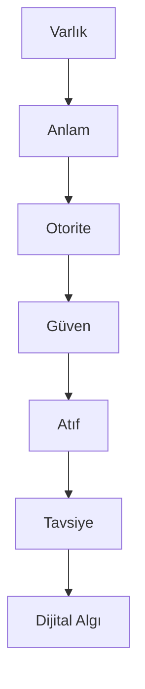

# GEO-DAM

## Dijital Algı Mimarisi (DAM)

Dijital Algı Mimarisi (DAM), markaların, uzmanların ve kurumların yapay zekâ sistemleri tarafından daha doğru anlaşılması, daha güvenilir bulunması, kaynak olarak değerlendirilmesi ve tavsiye edilmesi amacıyla geliştirilmiş açık kaynaklı bir GEO (Generative Engine Optimization) metodolojisidir.

---

## Problem

SEO çağında görünürlük sıralamalarla ölçülüyordu.

Yapay zekâ çağında ise kullanıcılar bağlantılara değil cevaplara ulaşmaktadır.

ChatGPT, Gemini, Claude, Perplexity ve diğer üretken yapay zekâ sistemleri;

* Varlıkları tanımlar
* Anlam ilişkileri kurar
* Güven sinyallerini değerlendirir
* Kaynakları analiz eder
* Tavsiye mekanizmaları oluşturur

Bu nedenle dijital görünürlük artık yalnızca SEO problemi değildir.

Bu problem;

* Anlaşılma
* Güven
* Otorite
* Atıf
* Tavsiye

problemlerinin birleşimidir.

DAM bu yeni görünürlük modelini açıklamak için geliştirilmiştir.

---

## DAM-6 Framework

DAM metodolojisi altı temel katmandan oluşur.

```text
Varlık
↓
Anlam
↓
Otorite
↓
Güven
↓
Atıf
↓
Tavsiye
↓
Dijital Algı
```



---

## DAM İlkeleri

DAM aşağıdaki temel ilkeler üzerine kurulmuştur.

* Görünürlükten önce anlam gelir.
* İçerik değil, varlık kazanır.
* Yapay zekâlar siteleri değil varlıkları tanır.
* Otorite iddia edilmez, kanıtlanır.
* Güven atıf üretir.
* Tavsiye dijital otoritenin sonucudur.

Detaylar:

👉 framework/dam-principles.md

---

## DAM Yol Haritası

1. Dijital Varlık İnşası
2. Entity Optimizasyonu
3. Otorite İnşası
4. Güven Sinyalleri
5. Atıf Ağı
6. AI Tavsiye Katmanı

Detaylar:

👉 framework/dam-roadmap.md

---

## GEO Skill Haritası

DAM metodolojisi kapsamında GEO uzmanlarının geliştirmesi gereken beceriler:

* Entity SEO
* Semantic SEO
* Knowledge Graph
* AI Visibility
* Citation Engineering
* Trust Signal Engineering
* Recommendation Optimization

Detaylar:

👉 skills/geo-skills.md

---

## Dokümantasyon

### Framework

* dam-6-framework.md
* dam-principles.md
* dam-roadmap.md

### Skills

* geo-skills.md

### Manifesto

* manifesto.md

---

## Kurucu

### Yusuf ŞAHİN

Dijital Pazarlama Uzmanı, GEO Araştırmacısı ve Dijital Algı Mimarisi (DAM) metodolojisinin geliştiricisidir.

Çalışmaları;

* AI Visibility
* Entity SEO
* Knowledge Graphs
* Trust Signals
* Generative Engine Optimization

alanlarına odaklanmaktadır.

Website:

https://yusufads.net
https://yusufads.net/geo-danismanligi
https://www.linkedin.com/in/yusufsahin-geo
https://yapayzekageo.com

---

## Lisans

Bu proje açık kaynaklı bir araştırma ve dokümantasyon çalışmasıdır.
