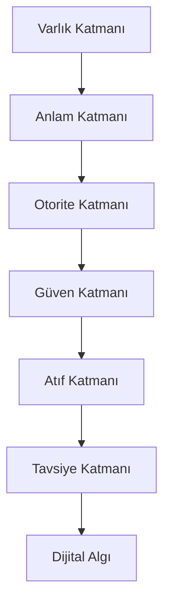

# DAM-6 Framework

DAM-6 Framework, Dijital Algı Mimarisi’nin temel modelidir.

Bu model, bir markanın, uzmanın ya da kurumun yapay zekâ sistemleri tarafından nasıl algılandığını açıklamak için altı temel katman kullanır.

DAM-6’ya göre yapay zekâ çağında dijital görünürlük şu zincir üzerinden oluşur:

Varlık → Anlam → Otorite → Güven → Atıf → Tavsiye

Bu zincir tamamlandığında dijital algı oluşur.

---

## 1. Varlık Katmanı

Varlık katmanı, DAM-6 modelinin başlangıç noktasıdır.

Bir marka, kişi veya kurum dijital dünyada tanımlanabilir bir varlık haline gelmeden güçlü bir GEO stratejisi kurulamaz.

### Bu Katmanın Sorusu

> Bu kişi, marka veya kurum dijital dünyada net biçimde tanımlanabiliyor mu?

### Temel Unsurlar

* Web sitesi
* Hakkında sayfası
* Sosyal medya profilleri
* GitHub profili
* LinkedIn profili
* Kurumsal sayfalar
* Marka ya da kişi biyografisi
* İletişim ve doğrulama bilgileri

### Başarı Kriteri

Dijital varlık farklı platformlarda aynı kişi, marka veya kurum olarak tanınabilmelidir.

---

## 2. Anlam Katmanı

Anlam katmanı, dijital varlığın hangi kavramlarla ve hangi uzmanlık alanlarıyla ilişkilendirileceğini belirler.

Yapay zekâ sistemleri yalnızca bir ismi görmekle yetinmez. O ismin neyi temsil ettiğini, hangi bağlamda değerlendirilmesi gerektiğini ve hangi konularla ilişkili olduğunu anlamaya çalışır.

### Bu Katmanın Sorusu

> Bu varlık neyi temsil ediyor ve hangi alanda anlam kazanıyor?

### Temel Unsurlar

* Uzmanlık alanı tanımı
* Entity açıklamaları
* Schema markup
* Kavram haritası
* Hizmet ve konu ilişkileri
* Semantik içerik yapısı
* Tutarlı profil açıklamaları

### Başarı Kriteri

Yapay zekâ sistemleri varlığın hangi alanda uzmanlaştığını ve hangi bağlamda değerlendirilmesi gerektiğini anlayabilmelidir.

---

## 3. Otorite Katmanı

Otorite katmanı, dijital varlığın alanındaki uzmanlığını kanıtlayan izlerden oluşur.

DAM-6’ya göre otorite beyan edilmez; dijital kanıtlarla inşa edilir.

### Bu Katmanın Sorusu

> Bu varlığın ilgili alanda otorite olduğunu gösteren ne var?

### Temel Unsurlar

* Uzman makaleleri
* Teknik dokümanlar
* Eğitimler
* Konferanslar
* Vaka analizleri
* Açık kaynak katkıları
* Araştırma notları
* Sektörel yayınlar

### Başarı Kriteri

Varlık, kendi alanında yalnızca içerik üreten değil, bilgi üreten ve referans alınabilecek bir kaynak haline gelmelidir.

---

## 4. Güven Katmanı

Güven katmanı, dijital varlığın doğrulanabilirliğini ve tutarlılığını güçlendirir.

Yapay zekâ sistemleri öneri üretirken güvenilirliği zayıf, çelişkili veya doğrulanamayan kaynakları öncelikli olarak tercih etmez.

### Bu Katmanın Sorusu

> Bu varlığa neden güvenilmeli?

### Temel Unsurlar

* Tutarlı marka bilgileri
* Gerçek kişi/kurum şeffaflığı
* Kaynak gösterilebilir içerikler
* Referans bağlantıları
* Güvenilir dış kaynaklar
* Açık iletişim bilgileri
* Düzenli güncellenen dijital profiller

### Başarı Kriteri

Varlık hakkında oluşan bilgiler farklı kaynaklarda tutarlı, doğrulanabilir ve güven verici olmalıdır.

---

## 5. Atıf Katmanı

Atıf katmanı, varlığın başka kaynaklar tarafından desteklenmesini ve kaynak olarak gösterilmesini ifade eder.

DAM-6’ya göre atıf, güvenin dış dünyadaki yansımasıdır.

### Bu Katmanın Sorusu

> Bu varlık başka güvenilir kaynaklar tarafından referans gösteriliyor mu?

### Temel Unsurlar

* Haber siteleri
* Blog yazıları
* Akademik ya da yarı akademik kaynaklar
* Medium ve LinkedIn makaleleri
* Podcast ve röportajlar
* Veri platformları
* Açık kaynak dokümantasyonları
* Sektörel listeler ve rehberler

### Başarı Kriteri

Varlık yalnızca kendi web sitesinde değil, farklı kaynaklarda da anlamlı biçimde yer almalıdır.

---

## 6. Tavsiye Katmanı

Tavsiye katmanı, DAM-6 modelinin nihai aşamasıdır.

Bu aşamada hedef, markanın veya uzmanın yapay zekâ sistemleri tarafından ilgili sorulara verilen yanıtlarda güvenilir bir seçenek olarak önerilmesidir.

### Bu Katmanın Sorusu

> Bu varlık hangi sorularda, hangi bağlamda ve hangi gerekçeyle önerilebilir?

### Temel Unsurlar

* AI Visibility testleri
* ChatGPT görünürlük kontrolleri
* Gemini ve Claude sorgu analizleri
* Perplexity kaynak kontrolleri
* Tavsiye senaryoları
* Eksik kaynak analizi
* Rakip görünürlük kıyaslaması

### Başarı Kriteri

Varlık, ilgili konuda yapay zekâ sistemlerinin cevaplarında güvenilir, anlaşılır ve tavsiye edilebilir bir seçenek haline gelmelidir.

---

## DAM-6 Akış Şeması

---

## DAM-6 Değerlendirme Soruları

Bir marka veya uzman DAM-6 modeline göre analiz edilirken şu sorular sorulabilir:

1. Bu varlık dijital dünyada net biçimde tanımlanıyor mu?
2. Hangi konuda uzmanlaştığı açık mı?
3. Bu uzmanlığı destekleyen otorite sinyalleri var mı?
4. Bilgileri farklı kaynaklarda tutarlı mı?
5. Güvenilir kaynaklardan atıf alıyor mu?
6. Yapay zekâ sistemleri tarafından önerilebilir mi?
7. Eksik kalan katman hangisi?
8. Dijital algı hangi noktada zayıflıyor?

---

## DAM-6 Modelinin Amacı

DAM-6 Framework, dijital görünürlüğü yalnızca trafik, sıralama veya anahtar kelime üzerinden değerlendirmez.

Bu modelin amacı daha derindir:

> Bir dijital varlığı, yapay zekâ sistemleri tarafından doğru anlaşılan, güvenilir kabul edilen, kaynak gösterilen ve tavsiye edilebilen bir otoriteye dönüştürmek.

Bu nedenle DAM-6, GEO alanında çalışan uzmanlar için bir analiz, planlama ve uygulama çerçevesi sunar.

